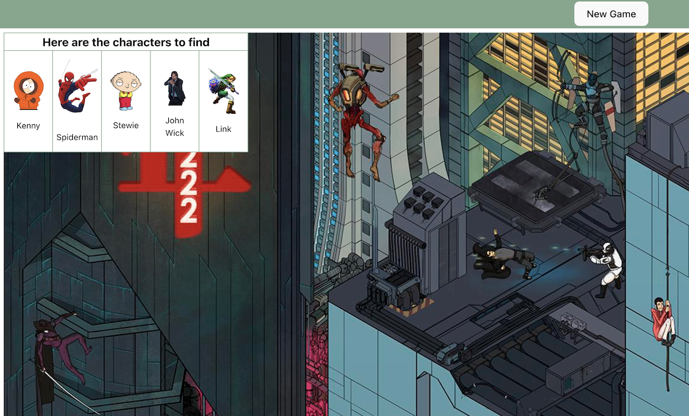

# Hidden Image Game (similar to Where's Waldo)

## Table of Contents

- [Description](#description)
- [Installation Instructions](#installation-instructions)
- [Usage and Screenshots](#usage-and-screenshots)
- [Technologies Used](#technologies-used)
- [Dependencies and Credits](#dependencies-and-credits)
- [Project Structure](#project-structure)

## Description

Image location game (similar to Where's Waldo) built as part of [The Odin Project](https://www.theodinproject.com) curriculum.

## Installation Instructions

1. Clone or fork this repo
2. cd into the project root directory (where the README.md file is located)
3. Run the following in your terminal
    - ``` bash
      npm init -y
      npm install react react-dom uuid
      npm install @eslint/js @types/react @types/react-dom --save-dev
      npm install @vitejs/plugin-react eslint --save-dev
      npm install eslint-config-prettier eslint-plugin-react-hooks eslint-plugin-react-refresh --save-dev
      npm install globals vite --save-dev
      ```
1. If running the API locally
   1. Find the URL
       - For a Node.js / Express app this would be in: *backend_folder/app.js* at the bottom
   2. Update the API URL
        -  ``` bash
           code src/functions/apiCommunication.js 
           ```
        - Update `const apiUrl` with the new URL. It is likely http://localhost:3000
          - `const apiUrl = "http://localhost:3000"`
          - Be sure to remove the trailing "/" if there is one
1. `npm run dev`
   - `^` + `c` will end the process 
1. In your browser, navigate to the url displayed in the terminal: `➜  Local:   http://localhost:5173/`

## Usage and Screenshots



This is an API so usage is simply via the endpoints.

- [Link to live preview](https://98256945.wheres-waldo-frontend-top.pages.dev/)
- [Link to backend repo](https://github.com/aRav3n/wheres_waldo_backend_TOP)

### Features

- Users can select a game (currently only one available)
- Once the game loads users click on the image where the target is and the coordinates are checked against the correct coordinates in the database

## Technologies Used

### Frontend

- <a href="https://vite.dev/"> Vite </a>
- <a href="https://react.dev/"> React</a>
- <a href="https://developer.mozilla.org/en-US/docs/Web/JavaScript"> JavaScript</a>
- <a href="https://developer.mozilla.org/en-US/docs/Web/HTML"> HTML</a>
- <a href="https://developer.mozilla.org/en-US/docs/Web/CSS"> CSS</a>

### Development Tools

- <a href="https://code.visualstudio.com/"> VS Code</a>
- <a href="https://www.npmjs.com/"> NPM</a>
- <a href="https://git-scm.com/"> Git</a>

### Hosting

- <a href="https://www.cloudflare.com/"> Cloudflare</a>
- <a href="https://github.com/"> Github</a>

## Dependencies and Credits

### Package Dependencies

- [@eslint/js](https://www.npmjs.com/package/@eslint/js)
- [@types/react](https://www.npmjs.com/package/@types/react)
- [@types/react-dom](https://www.npmjs.com/package/@types/react-dom)
- [@vitejs/plugin-react](https://www.npmjs.com/package/@vitejs/plugin-react)
- [eslint](https://www.npmjs.com/package/eslint)
- [eslint-config-prettier](https://www.npmjs.com/package/eslint-config-prettier)
- [eslint-plugin-react-hooks](https://www.npmjs.com/package/eslint-plugin-react-hooks)
- [eslint-plugin-react-refresh](https://www.npmjs.com/package/eslint-plugin-react-refresh)
- [globals](https://www.npmjs.com/package/globals)
- [react-dom](https://www.npmjs.com/package/react-dom)
- [uuid](https://www.npmjs.com/package/uuid)

### Other Credits

- [Devicion](https://devicon.dev/)
- [Skillicons](https://skillicons.dev/)
- Search images are from the [Wimmelbilder subreddit](https://www.reddit.com/r/wimmelbilder/)
- Favicon is from [Pictogrammers](https://pictogrammers.com/library/mdi/)

## Project Structure

```bash
├──public/                 # Locally stored images
└──src/                    # Source files
```
